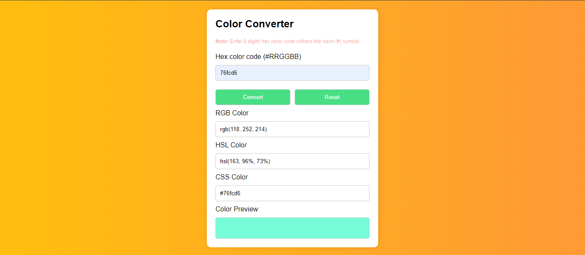

# Color Converter

This is a simple color converter that converts HEX to RGB, HSL, CSS Color Name and Color Preview. 

## Technologies
- HTML
- CSS
- JavaScript

## How to use
1. Enter a HEX color code in the input field.
2. Click the `Convert` button.
3. The converter will display the RGB, HSL, CSS Color Name and Color Preview.
4. Copy the color code and use it in your project.
5. Click the `Reset` button to clear the input field.

## Demo

